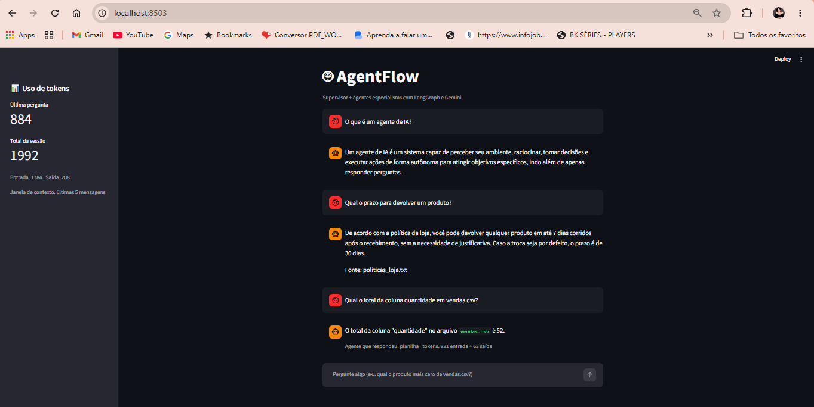

# AgentFlow

Plataforma de automação com agentes de IA, construída com **LangGraph** e **Gemini**.

O projeto evolui por etapas: de um grafo simples até agentes que usam ferramentas, leem dados, lembram da conversa, trabalham em equipe com um supervisor, têm interface web e consultam documentos com RAG.



## O que já funciona

| Arquivo | O que faz |
|---|---|
| `grafo_basico.py` | Primeiro grafo do LangGraph, conectado ao Gemini |
| `agente_ferramentas.py` | Agente que decide sozinho entre responder direto ou usar ferramentas (soma e data/hora) |
| `agente_planilha.py` | Agente que lê planilhas CSV e responde perguntas sobre os dados |
| `agente_memoria.py` | Agente que lembra da conversa (memória por `thread_id`) |
| `agente_multiagente.py` | Supervisor que delega a pergunta para agentes especialistas |
| `app_web.py` | Interface web de chat (Streamlit) sobre o sistema multiagente |
| `agente_rag.py` | Agente RAG: busca em documentos e responde citando a fonte |

## Como o agente funciona

```
START -> agente -> (precisa de ferramenta?) -> ferramentas -> agente -> resposta
```

O modelo analisa a pergunta e **decide** se responde direto ou chama uma ferramenta. Depois de executar, ele volta ao agente, que usa o resultado para escrever a resposta final.

## Arquitetura multiagente

```
                 +--> planilha (ler_planilha, somar_coluna)
START -> supervisor --> calculo (somar, data_e_hora_atual)
                 +--> geral (sem ferramentas)
```

O **supervisor** lê a pergunta e escolhe qual agente especialista vai respondê-la. Cada especialista tem as suas próprias ferramentas e instruções. A interface web mostra, abaixo de cada resposta, qual agente respondeu.

## RAG sobre documentos

```
documentos (.txt) -> pedaços (chunks) -> embeddings -> índice vetorial
pergunta -> busca por similaridade -> trechos relevantes -> agente responde com a fonte
```

- Os documentos ficam na pasta `base_conhecimento/`.
- Os embeddings são gerados com `gemini-embedding-001`.
- O agente é instruído a responder **somente** com base nos trechos encontrados, a citar o arquivo de origem e a admitir quando não encontra a informação.

## Exemplos de execução

### Agente com ferramentas

```
Pergunta: Qual o total da coluna quantidade em